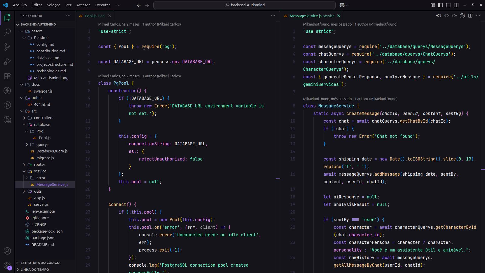

# Minhas Configurações de VS Code

Este repositório contém minhas configurações e extensões do VS Code. Sinta-se à vontade para explorar e usar o que gostar! Estas configurações foram otimizadas para o desenvolvimento web.

-----

### Extensões

Baseado nas minhas configurações, aqui estão as extensões que utilizo para otimizar meu fluxo de trabalho em diferentes linguagens:

  - **[PHP CS Fixer](https://marketplace.visualstudio.com/items?itemName=junstyle.php-cs-fixer)**: Um formatador de código PHP que garante que seu código siga as regras de estilo predefinidas.
  - **[Black Formatter](https://marketplace.visualstudio.com/items?itemName=ms-python.black-formatter)**: Um formatador de código Python para manter um estilo de código consistente e legível.
  - **[Prettier - Code formatter](https://marketplace.visualstudio.com/items?itemName=esbenp.prettier-vscode)**: Um formatador de código muito popular que garante um estilo consistente em diversas linguagens, como JavaScript, HTML e CSS.
  - **[Live Server](https://www.google.com/search?q=https://marketplace.visualstudio.com/items%3FitemName%3Dritwickdey.liveserver)**: Lança um servidor de desenvolvimento local que recarrega a página no navegador automaticamente a cada vez que você salva o arquivo.
  - **[Aura Theme](https://marketplace.visualstudio.com/items?itemName=DaltonMenezes.aura-theme)**: Um belo tema de cores escuro, com variantes, que proporciona uma experiência de codificação confortável.
  - **[Symbols](https://marketplace.visualstudio.com/items?itemName=miguelsolorio.symbols)**: Um tema de ícones para o explorador de arquivos que adiciona ícones distintos para cada tipo de arquivo, melhorando a navegação visual.
    
-----

### Como Usar

Se você gostou das minhas configurações e quer usá-las, siga estes passos:

1.  **Clone o Repositório**: Faça o download deste repositório para o seu computador.
2.  **Copie as Configurações**: Copie o conteúdo do arquivo **`settings.json`** para os seus respectivos arquivos de configuração do VS Code. Você pode encontrá-los facilmente no menu do VS Code, em `File > Preferences > Settings` (ou usando o atalho `Ctrl+,`).
3.  **Instale as Extensões**: Abra a barra lateral de extensões (use o atalho `Ctrl+Shift+X`) e procure e instale as extensões listadas na seção **"Extensões"** deste `README`.

-----

### Prévia do Visual

Veja como meu VS Code se apresenta com todas as configurações, temas e extensões aplicadas.

*O código na imagem é apenas um exemplo visual e não é de minha autoria.*

*Créditos ao autor original: **[Mikael Carlos](https://github.com/Mikaelnotfound)**.*

-----
